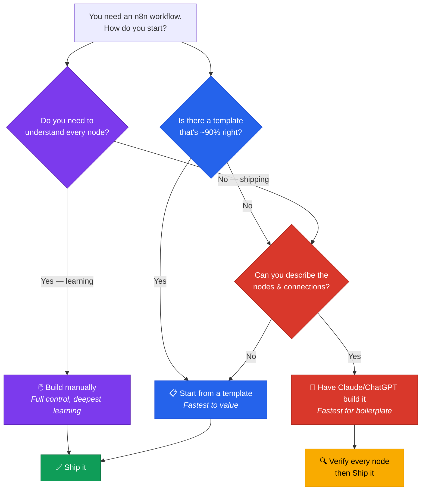

<div align="center">

# 🛠️ NextLeap — Building n8n Workflows & Sharing on GitHub

**Three ways to build an n8n workflow — manual, community templates, or generated by Claude/ChatGPT — plus a practical, tested guide to publishing what you build safely on GitHub.**

[](https://n8n.io)
[](#-method-1--build-manually-on-the-canvas)
[](#-method-2--start-from-a-community-template)
[](#-method-3--have-claude-or-chatgpt-build-it)
[](#-the-scrub-checklist)
[](https://github.com/Gursimaran21)
[](LICENSE)

</div>

---

## 📖 Overview

This session is about the craft around the canvas — how you build a workflow, and how you package it so someone else can actually use it.

It ships with **one demo workflow built three different ways**, so you can compare the fingerprint each method leaves behind:

| File | Built via |
| --- | --- |
| [`Demo A - Built Manually.json`](Demo%20A%20-%20Built%20Manually.json) | 🖱️ Method 1 — hand-built on the canvas |
| [`Demo B - From Community Template.json`](Demo%20B%20-%20From%20Community%20Template.json) | 📋 Method 2 — from the community template gallery |
| [`Demo C - AI Generated.json`](Demo%20C%20-%20AI%20Generated.json) | 🤖 Method 3 — generated by an LLM |

All three do the same thing (**Daily Tech News Digest**), so the only variable is *how it was made*.

### Agenda

| Segment | Duration | Topic |
| --- | --- | --- |
| Sharing n8N workflows and putting on GitHub | 5 mins | Export, scrub, document, publish |
| Building n8N workflows | 10 mins | Manual · Community templates · AI-generated |

---

## 🧭 Which Method Should I Use?



> **In practice:** all three combine. Use AI to scaffold the boring plumbing, a template for anything standard, and hand-build the part that actually matters.

---

## 🖱️ Method 1 — Build Manually on the Canvas

Drag nodes, wire ports, attach credentials.

**The way it's done:**

1. **Start from the trigger.** Add the node that starts your workflow — Schedule, Webhook, Chat Trigger, MCP Trigger.
2. **Add one node at a time** and connect the main output to the next input.
3. **Set parameters** in the node panel. Most have a `{{ }}` expression editor — switch to it to write JavaScript.
4. **Attach credentials** from the credentials dropdown. Never paste API keys into parameters.
5. **Test incrementally** — run *one* node at a time with **Execute step** before wiring the next.

### Strengths & limits

| ✅ Strengths | ⚠️ Limits |
| --- | --- |
| Total control over every parameter | Slow for anything with many nodes |
| You learn the node schemas properly | Repetitive for boilerplate (HTTP calls, Set nodes) |
| No dependency on template quality | Easy to forget a setting buried in a sub-panel |

### Practical tips

- **Name your nodes meaningfully.** `Fetch Customer Data` beats `HTTP Request1`. You'll thank yourself in the execution log.
- **Keep the canvas tidy.** Left-to-right layout. Sub-agents below their orchestrator. It costs nothing and makes reviews possible.
- **Save a checkpoint copy** (`Ctrl/Cmd + S`) before big edits. n8n's undo is limited.

---

## 📋 Method 2 — Start from a Community Template

Browse the official gallery at **[n8n.io/workflows](https://n8n.io/workflows)**, or **Templates → Browse Workflows** inside n8n.

### The way it's done:

1. **Search** by integration or use case: `"gmail"`, `"calendar"`, `"multi agent"`.
2. **Preview** the workflow — the template page shows a diagram and the nodes used.
3. **Use this template** → it opens in your instance, fully editable.
4. **Re-map the credentials** — templates ship with credential *placeholders* that you must re-bind.
5. **Prune** anything you don't need, then **rename** the workflow.

### Strengths & limits

| ✅ Strengths | ⚠️ Limits |
| --- | --- |
| Instant working baseline | Often close-but-not-quite — expect to rework |
| Shows idiomatic, community-blessed patterns | May use old node versions |
| Great for learning how experts structure workflows | Requires credentials the template author invented |

### Practical tips

- **Check the node type versions.** A template using `typeVersion: 1` nodes may look different from what your n8n version expects. Re-saving from your instance upgrades them.
- **Strip before you keep.** Delete unused credentials, sample data, and any hardcoded emails the author left behind.
- **Make it yours.** A README that says "based on the official X template" is honest and respects the original author.

---

## 🤖 Method 3 — Have Claude or ChatGPT Build It

Describe the workflow in plain English; have the LLM output n8n JSON you can import.

### The way it's done:

1. **Find a reference export.** Build a 2-node workflow by hand, export it, and read the JSON. That's your schema reference.
2. **Give the LLM exact node types + versions**, including the `parameters`, `type`, `typeVersion`, `position`, and `connections` structure.
3. **Save the response as `.json`**.
4. **Import into n8n** — Workflows → Import from File.
5. **Verify every single node.** This step is not optional.

### A prompt that actually works

```text
Write an n8n workflow JSON. Requirements:

TRIGGER: scheduleTrigger, typeVersion 1.4, fires daily at 6am

AGENT: @n8n/n8n-nodes-langchain.agent, typeVersion 3.1
  promptType "define", with an explicit text prompt

MODEL: @n8n/n8n-nodes-langchain.lmChatGroq, typeVersion 1

TOOLS (connect to the agent via "ai_tool"):
  - n8n-nodes-base.googleCalendarTool, typeVersion 1.3, operation getAll
  - n8n-nodes-base.gmailTool, typeVersion 2.2

Output valid JSON matching n8n's workflow export schema:
top-level keys "name", "nodes", "connections", "settings".
Each node needs: parameters, type, typeVersion, position, id, name.
Each connection needs: node, type ("main" | "ai_tool" |
"ai_languageModel" | "ai_memory"), index.
Do not include credential values.
```

> 🎯 **The secret:** vague prompts produce vague JSON. Specify the exact `type` and `typeVersion` strings and you skip the whole debugging loop.

### Strengths & limits

| ✅ Strengths | ⚠️ Limits |
| --- | --- |
| Extremely fast for plumbing and boilerplate | **Hallucinated parameters** are near-guaranteed |
| Great for repetitive node structures | May use outdated node versions |
| Excellent at generating the `connections` graph | Never trusts its own output — always test |
| Produces readable, well-named node IDs | Zero understanding of your actual credentials |

> ⚠️ **Never paste your real credentials into the prompt.** Credentials live in n8n, not in the JSON you ask an LLM to write. Strip them from the output before sharing.

---

## ⚖️ Method Comparison

| | Manual | Template | AI-generated |
| --- | --- | --- | --- |
| **Speed** | 🐢 Slow | 🐇 Fastest | 🐇 Fast |
| **Control** | ✅ Total | ⚠️ Partial | ⚠️ Partial |
| **Reliability** | ✅ You test it | ⚠️ Usually works | ⚠️ Verify everything |
| **Learning value** | ✅✅ Highest | ✅ Good | ⚠️ Low unless reviewed |
| **Boilerplate handling** | ❌ Tedious | ✅ Handled | ✅ Handled |
| **Best for** | Novel logic, learning | Standard integrations | Repetitive structures |

---

## 📤 Sharing Workflows on GitHub

### Step 1 — Export

In n8n: open the workflow → **⋮ → Download** → save as JSON.

### Step 2 — Name it well

| Item | Convention | Example |
| --- | --- | --- |
| **Workflow name** | `Purpose — Pattern` | `Calendar Assistant — Daily Briefing` |
| **File name** | Same as workflow name, `.json` | `Calendar Assistant.json` |
| **Repo name** | `NextLeap-<Topic>-<DD Month YYYY>` | `NextLeap-Multi-Agent-System-Newsletter-Agent-04-October-2026` |
| **Commit message** | Conventional Commits | `feat: add orchestrator agent as tool pattern` |

> 💡 Use **uppercase month names with a space-free `-`** in repo names to avoid case-sensitivity surprises on Linux runners and in URLs.

---

## 🔍 Comparing the Three Demos

Same workflow, three build methods. Diff them and each method's signature is obvious.

| | **A — Manual** | **B — Template** | **C — AI-generated** |
| --- | --- | --- | --- |
| **Node names** | `Every Day at 7am`, `Fetch Tech News`, `Write the Digest` | `Schedule Trigger`, `RSS Feed Read`, `AI Agent` | `Schedule Trigger`, `RSS Feed Read`, `AI Agent` |
| **Naming style** | ✅ Describes *intent* | ⚠️ Generic node labels | ⚠️ Generic node labels |
| **Layout** | ✅ Tidy left-to-right, model below | Neat but default | Compressed, minimal spacing |
| **Formatting** | ✅ Consistent | ✅ Consistent | ⚠️ **Inconsistent indentation** |
| **`meta` flag** | `templateCredsSetupCompleted: false` | `true` — template provenance | `false` |
| **Tags** | none | `From Template` | none |

### What to take from this

- **Naming is the single biggest tell.** A hand-built workflow names nodes after what they *do*; templates and LLM output both default to node *type* names. If you inherit a workflow called `HTTP Request1`, rename it before sharing.
- **Demo C's broken indentation is authentic.** LLM-generated JSON is usually valid but inconsistent. It's harmless here — but it's exactly why you must **verify every node** rather than trusting the output.
- **Templates leave provenance behind.** The `meta.templateCredsSetupCompleted` flag and the `From Template` tag tell you (and future readers) where a workflow came from. Keep that information.

### Running the demo

All three need credentials attached after import:

| Node | Credential | Scope |
| --- | --- | --- |
| `OpenAI Chat Model` | OpenAI account *(or use n8n Cloud AI Gateway)* | — |
| `Send Email` | Gmail account | `https://www.googleapis.com/auth/gmail.send` |

Then change `you@example.com` in the Gmail node to your real address, and run it.

---

## 🚨 The Scrub Checklist

**This is the part everyone forgets — including us.**

When you export from n8n, your workflow JSON carries identifying information from *your* instance. Pushing it as-is publishes it to the world.

### What gets baked in

| Leak | Where it appears | Risk |
| --- | --- | --- |
| **Credential IDs** | `"credentials": { "gmailOAuth2": { "id": "a1b2c3d4e5f6…" } }` | Instance-specific UUID. Broken elsewhere; a fingerprint of your instance. |
| **Your email address** | `sendTo`, `calendar.value`, `cachedResultName` | Spam, phishing, social engineering |
| **Your n8n base URL** | `mcpClientTool.endpointUrl` | Exposes your instance hostname & workspace |
| **Google Doc / Sheet IDs** | `googleDriveTool.fileId` | Grants access if the doc is shared |
| **Webhook / trigger paths** | `mcpTrigger.path`, `webhookId` | **Secret capability URL** — anyone with it can call your tools |
| **Execution data** | Executions view | Customer data, tokens, message bodies |

### Pre-publish checklist

- [ ] Replace **all** email addresses with a placeholder (`you@example.com`)
- [ ] Replace your **n8n instance URL** with a placeholder or relative note
- [ ] Replace **Google Doc / Drive / Sheet IDs** with a description ("your Google Doc")
- [ ] Review every **trigger path** — regenerate if this is going to a public repo
- [ ] Remove **pinned data** (`"pinData": {}`) — it can hold live test data
- [ ] Confirm no **API keys** appear in any parameter (they belong in credentials, but always check)
- [ ] Clear or delete **execution history** before exporting if it influenced the JSON

### Find leaks fast

```bash
# Scan a workflow export for anything that shouldn't be public
rg -n '"(credentials|sendTo|endpointUrl|fileId|cachedResultName)"|@gmail|@google|\.app\.n8n\.cloud' *.json
```

Or per-value:

```bash
rg -n 'your@email\.com|docs\.google\.com/document/d/|app\.n8n\.cloud' *.json
```

> 🔐 **Credentials are the one thing that is actually safe to commit.** The JSON only ever stores the credential *ID* and *name*, never the secret. The secret lives in n8n's encrypted database. Committing an export does **not** leak your API keys.

---

## 📂 Recommended Repo Structure

```text
NextLeap-Your-Project-04-October-2026/
├── Workflow Name.json      # The workflow — importable
├── README.md               # Overview, architecture, setup, troubleshooting
├── LICENSE                 # MIT
└── .gitattributes          # Normalize line endings (optional but good)
```

> ✅ **This repo follows the structure above** — it holds the three demo workflows, a README, and a LICENSE. And every `.json` here is already scrubbed: no credential IDs, no real email addresses, no instance URLs. Compare against [the earlier workshop repos](https://github.com/Gursimaran21/NextLeap-Multi-Agent-System-Newsletter-Agent-04-October-2026) to see what an unscrubbed export looks like.

**`.gitattributes`** — worth adding to keep diffs clean across Windows/macOS/Linux:

```gitattributes
*.json text eol=lf
*.md   text eol=lf
```

### Push it

```bash
git init
git add .
git commit -m "feat: initial workflow release"
git branch -M main
git remote add origin https://github.com/<user>/<repo>.git
git push -u origin main
```

### The README essentials

Every workflow repo should answer five questions in under 30 seconds of reading:

1. **What does it do?** One paragraph, plain English.
2. **What does it look like?** A diagram — Mermaid renders natively on GitHub.
3. **What's required?** n8n, credentials, scopes, API keys.
4. **How do I set it up?** Numbered steps, starting with import.
5. **What breaks and why?** A troubleshooting table.

---

## 🔧 Troubleshooting Shared Workflows

| Symptom | Cause | Fix |
| --- | --- | --- |
| Import fails immediately | Malformed JSON | Validate with `jq . Workflow.json` |
| Nodes look different | Outdated `typeVersion` | Re-save from your n8n instance to upgrade |
| "Credential not found" | Expected on every import | Re-attach credentials — **this is not a bug** |
| Tool node does nothing | `ai_tool` connection missing | Check the node's `connections` block |
| 404 from an MCP endpoint | Author's URL was committed | Replace with your own instance URL + path |
| Email goes to the wrong person | Author's address left in place | Search the JSON for `@` and replace |
| Google Doc permission error | Author's file ID committed | Re-select **your own** doc in the node |
| Works locally, fails for others | Undocumented credential dependency | Document scopes in the README |

---

## 🎓 Workshop Context

Built as part of a **NextLeap AI Engineer bootcamp** series.

| Segment | Duration | Focus |
| --- | --- | --- |
| Sharing n8N workflows and putting on GitHub | 5 mins | Export, scrub, document, publish |
| Building n8N workflows | 10 mins | Manual · Templates · AI-generated |

### Session map

| # | Repo | Introduced |
| --- | --- | --- |
| 1 | [Google Calendar AI Assistant](https://github.com/Gursimaran21/NextLeap-Google-Calendar-Assistant-04-October-2026) | Single agent + tools, on a schedule |
| 2 | [Build MCP Server and Client](https://github.com/Gursimaran21/NextLeap-Built-MCP-Server-and-Client-04-October-2026) | MCP — tools over a standard protocol |
| 3 | [Multi-Agent System — Newsletter Agent](https://github.com/Gursimaran21/NextLeap-Multi-Agent-System-Newsletter-Agent-04-October-2026) | Multi-agent orchestration |
| 4 | **This repo** | Building and sharing workflows |

**Key takeaways:**

- **There is no wrong way to build** — but AI-generated JSON always needs verification.
- **An export is not a secret** — it carries your email, your URLs, and your document IDs. Scrub before you push.
- **A good README is part of the deliverable.** A workflow nobody can set up is a workflow nobody can use.

---

## 📄 License

Released under the [MIT License](LICENSE).

---

## 👤 Author

**Gursimaran** — [GitHub @Gursimaran21](https://github.com/Gursimaran21)

---

## 🔗 Resources

- [n8n workflow templates](https://n8n.io/workflows)
- [n8n docs](https://docs.n8n.io)
- [n8n community forum](https://community.n8n.io)
- [Conventional Commits](https://www.conventionalcommits.org)
- [Mermaid syntax on GitHub](https://docs.github.com/en/get-started/writing-on-github/working-with-advanced-formatting/creating-diagrams)

---

<div align="center">

**Built with 🛠️, 🧹 and a healthy fear of leaking API keys.**

</div>